# Домашний сервер / Homelab

[](https://github.com/jetpackfm/mpd_server)

Второй проект из серии: https://github.com/jetpackfm/nextcloud-family-vpn

## 📖 Описание проекта

Под рукой имелся старый компьютер, давно вышедший из эксплуатации. Выкидывать стало жалко, и было принято решение проапгрейдить его (насколько возможно) и сделать домашний сервер с каким-нибудь лёгким и приятным сервисом. После некоторых раздумий выбор пал на **[MPD](https://www.musicpd.org/)** (Music Player Daemon), развёрнутый в **Linux Mint**, так как в наличии была акустическая система.

💭 Конечно, можно просто сказать: *«Алиса, включи Лепса»*, но в данном случае музыкальный сервер — это лишь тестирование результата. Основная цель: дать вторую жизнь старому железу, разобраться в сетях и Linux и получить бесценный опыт. Что в итоге и получилось.

## 📦 Состав проекта

- Сборка сервера из старого ПК
- Настройка Linux Mint
- Сетевая инфраструктура на MikroTik hAP ac²
- Изоляция сервера в отдельный VLAN
- Музыкальный сервер MPD

---

## 🖥️ Железо

| Компонент | Модель |
|-----------|--------|
| **Материнская плата** | ASUS M4A87TD TurboV EVO |
| **Процессор** | AMD Phenom II X4 945 |
| **ОЗУ** | 16 ГБ DDR3 |
| **Видеокарта** | Radeon Sapphire HD 5770 |
| **Блок питания** | FSP HV PRO 550W 85 Plus |
| **Кулер процессора** | Snowman M-T4 |
| **Кулер корпусной** | Arctic F12 |
| **Сетевая карта** | Realtek RTL8125 2.5GbE |
| **Звуковая карта** | Creative SB0570 |
| **PCI-E переходник** | для NVMe SSD |
| **SSD (система)** | AMD Radeon R5 128 ГБ |
| **NVMe SSD** | Lexar NQ6A1 512 ГБ |
| **HDD** | Hitachi 1 ТБ |
| **HDD** | WDC 500 ГБ |

💰 Практически всё железо было заменено, но, несмотря на это, апгрейд обошёлся довольно экономно. Пришлось докупить SSD на 128 ГБ для системы (Lexar через переходник PCI-E не определялся при запуске — сказался устаревший BIOS), БП, кулер процессора, задний кулер, ОЗУ и сетевую карту. В сумме вышло **~8000 рублей**.

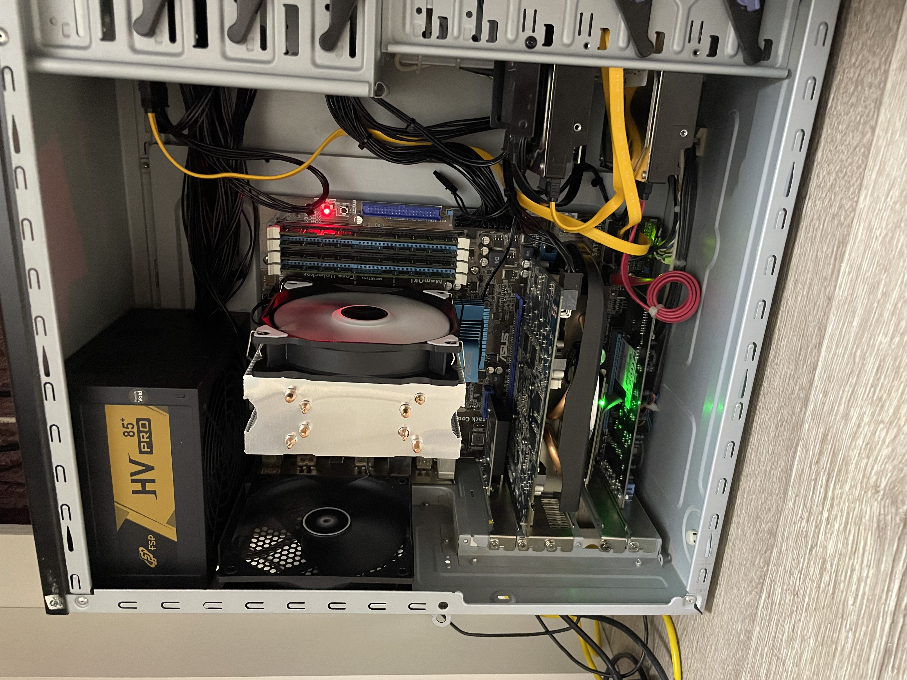
*Внутренности сервера после апгрейда*

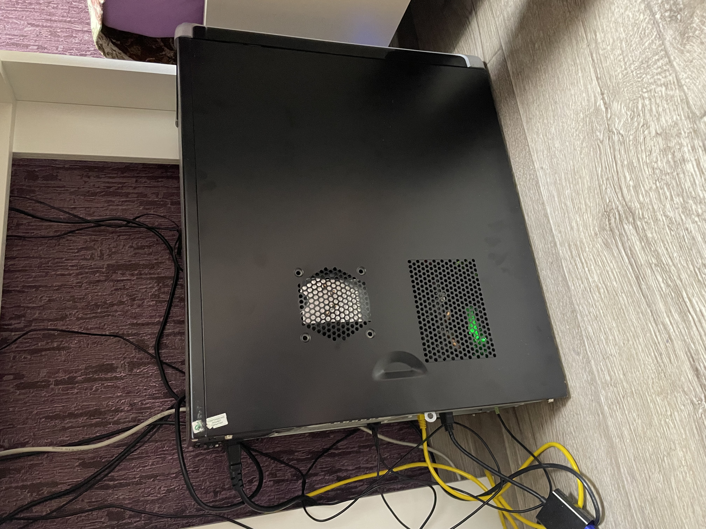
*Сервер в сборе*

---

## 🐧 Linux Mint

### Установка ОС
После сборки сервера настало время установить ОС. Сомнений не было — **Linux Mint с Xfce GUI**, так как я уже имел с ним дело, и его лёгкость и простота оставили только положительные эмоции.

**Ссылка для скачивания:** [linuxmint.com/download.php](https://linuxmint.com/download.php)

Записал образ на флешку через **[BalenaEtcher](https://etcher.balena.io/)** (можно Rufus), запустил live-версию Mint на сервере и, прежде чем перейти к установке, поработал с накопителями (их четыре).

### Подготовка дисков

Смотрим, что вообще имеется (интересуют названия дисков):

``` bash
sudo lsblk -f
```

Очищаем сигнатуры и таблицы разделов на всех дисках:

```bash
sudo wipefs -a /dev/название_диска
```
> [!CAUTION]
>⚠️ **Внимание!** Это удалит все данные без возможности восстановления.

Далее выполняем **стандартную установку**. Выбираем диск для системы, ничего не меняем — пусть установщик сам разметит разделы под загрузчик и систему.

### Настройка автомонтирования дисков

После установки настраиваем автомонтирование остальных дисков.

**Создаём новую таблицу разделов GPT на каждом диске** (выполняем в терминале `Ctrl+Alt+T`):

```bash
sudo fdisk /dev/название_диска
```
Внутри fdisk:
- Нажмите **g** — создать новую таблицу GPT.
- Нажмите **n** — новый раздел.
- Несколько раз **Enter**, чтобы создать один раздел на весь диск (если в конце спросит: Do you want to remove the signature? — нажмите **Y**).
- Нажмите **w** — записать изменения.

Форматируем диск в **ext4** с удобной меткой:
```bash
sudo mkfs.ext4 /dev/название_диска -L удобное_название
```
Пример:
```bash
sudo mkfs.ext4 /dev/nvme0n1p1 -L Data_NVMe
```
> [!CAUTION]
>⚠️ **Внимание!** Данные с дисков будут стёрты.

Создаём папки для монтирования:
```bash
sudo mkdir -p /mnt/nvme /mnt/hdd1 /mnt/hdd2
```
Получаем **UUID** дисков для fstab:
```bash
sudo blkid /dev/название_диска1 /dev/название_диска2 /dev/название_диска3
```
Редактируем **/etc/fstab**:
```bash
sudo nano /etc/fstab
```
В конец добавляем строки (пример для NVME):

\# NVMe 512 ГБ
UUID="uuid_диска" /mnt/nvme ext4 defaults,noatime 0 2

Монтируем всё и проверяем:
```bash
sudo mount -a
lsblk -f
```
Диски должны примонтироваться в указанные директории.

Делаем себя владельцем:
``` bash
sudo chown -R $USER:$USER /mnt/nvme /mnt/hdd1 /mnt/hdd2
```
### Добавление дисков в закладки

Теперь через проводник можно добавить смонтированные диски в закладки:

- Открыть домашнюю директорию
- Перейти в /mnt/
- Выбрать диск
- В меню: Закладки → Добавить закладку

Диски появятся слева и будут всегда под рукой.

---

## 🌐 Настройка статического IP на сервере
Чтобы IP сервера не менялся после перезагрузки, настроим его вручную.

### 📌 Вариант 1 — через графический интерфейс (самый простой)

- На сервере кликнуть ПКМ на иконку сети в правом нижнем углу (рядом с часами)
- Выбрать "Network Settings" (Параметры сети)
- Найти активный сетевой интерфейс (например, Ethernet или тот, который с 2.5GbE картой)
- Нажать на шестерёнку (настройки)
- Перейти на вкладку Параметры IPv4
- Выбрать "Manual" (Вручную)
- Нажать Добавить. Заполняем:
  - Address: 10.10.10.254 (или тот IP, который вы хотите закрепить)
  - Netmask: 255.255.255.0 (или /24)
  - Gateway: 10.10.10.1 (IP MikroTik в VLAN)
  - DNS: 8.8.8.8, 8.8.4.4
- Нажать Apply

### 📌 Вариант 2 — через терминал (надёжнее)

#### Узнать имя интерфейса
```bash
ip a
```
#### Создать бэкап
```bash
sudo cp /etc/netplan/01-network-manager-all.yaml /etc/netplan/01-network-manager-all.yaml.bak
```
#### Отредактировать файл
```bash
sudo nano /etc/netplan/01-network-manager-all.yaml
```
Вставляем новый конфиг (замените enp2s0 на имя своего интерфейса):
```yaml
network:
  version: 2
  renderer: networkd
  ethernets:
    enp2s0:
      dhcp4: false
      addresses:
        - 10.10.10.254/24
      routes:
        - to: default
          via: 10.10.10.1
      nameservers:
        addresses: [8.8.8.8, 8.8.4.4]
```
#### Применить настройки
```bash
sudo netplan apply
```
#### Проверить результат
```bash
ip a | grep 10.10.10
ping 8.8.8.8
```
### 📌 Вариант 3 — через ifupdown (альтернатива)

Если Netplan не используется, можно настроить через **/etc/network/interfaces**:
```bash
sudo nano /etc/network/interfaces
```
Добавить или изменить:
```text
auto enp2s0
iface enp2s0 inet static
    address 10.10.10.254
    netmask 255.255.255.0
    gateway 10.10.10.1
    dns-nameservers 8.8.8.8 8.8.4.4
```
Перезапустить сеть:
```bash
sudo systemctl restart networking
```
##### ✅ Проверка

После настройки перезагрузить сервер:
```bash
sudo reboot
```
И убедиться, что IP остался прежним:
```bash
ip a | grep 10.10.10
```
##### ✅ Теперь сервер всегда будет доступен по одному и тому же адресу.

---

## 🌐 Сеть

Исходная ситуация

У меня дома в прихожей висит провайдерский роутер **MGTS GPON**, который раздаёт Wi-Fi в
ближайшие комнаты. Со своей задачей он справляется отлично, кроме самой дальней комнаты - 
моей. Сигнал туда практически не доходит, поэтому я поставил у себя простенький **TP-Link
Archer C80**, соединённый с GPON патч-кордом.Проблема была в том, что TP-Link создавал свою
подсеть, и устройства из комнаты не видели другие устройства в квартире, подключённые к GPON.
К тому же приходилось вручную переключать Wi-Fi при перемещении по квартире — классический
каскадный режим, неудобный в повседневной жизни.

#### 🗺️ Схема сети

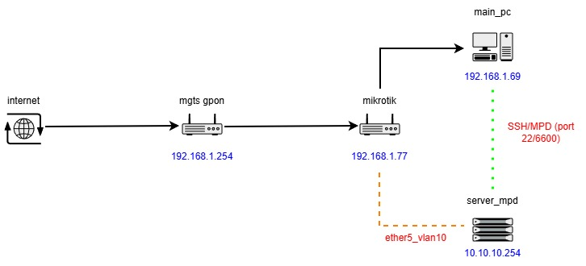

*Схема домашней сети: GPON → MikroTik → сервер в VLAN 10*

#### 🎯 Решение

Так как у меня имеется **MikroTik hAP ac²**, я решил использовать его. План был такой:
- Настроить MikroTik в режим моста (Bridge), чтобы он не создавал свою подсеть, а был прозрачным продолжением GPON.
- Выделить один порт в VLAN для сервера, чтобы изолировать его от остальных устройств.
- Разрешить доступ к серверу только с основного ПК по SSH.
- Получить бесшовный Wi-Fi по всей квартире.
- - -
### 🔧 Настройка MikroTik

#### Подготовка

Скачиваем **WinBox** — утилиту для управления MikroTik: [WinBox](https://mikrotik.com/download/winbox)

Можно также зайти через браузер по адресу 192.168.88.1 (стандартный IP заводской конфигурации), но я рекомендую WinBox: в нём удобнее, и после смены IP роутера не придётся ловить соединение заново.

Подключаемся к роутеру. Логин: **admin**, пароль пустой.
#### Сброс к заводским настройкам
Нам нужен полностью пустой роутер — без стандартной конфигурации. Есть два способа:
##### Способ 1 (аппаратный):
- Отключить питание
- Зажать кнопку res/wps
- Не отпуская кнопку, включить питание
- Держать, пока не начнёт мигать индикатор usr, затем отпустить
- При первом входе выбрать Remove Settings
##### Способ 2 (через WinBox):
- System → Reset Configuration
- Выбрать опцию No Default Configuration
- Нажать Reset Configuration

> [!CAUTION]
> ⚠️**Внимание!** После сброса роутер потеряет IP-адрес, и зайти в него через браузер (WebFig) не получится. Используйте WinBox и подключайтесь по MAC-адресу (он отображается во вкладке Neighbors).

##### Интерфейсы роутера
После сброса в Mikrotik будут доступны следующие интерфейсы:

- ether1 — WAN (кабель от провайдера)
- ether2 — основной ПК
- ether3, ether4 — не используются
- ether5 — сервер
- wlan1, wlan2 — Wi-Fi 2.4 ГГц и 5 ГГц
#### Настройка режима моста (Bridge)
**Создаём мост:**

- Bridge → + New
- Name: bridge1 → OK

**Добавляем интерфейсы в мост:**

- Bridge → Ports → + New
- Добавляем по очереди все интерфейсы: ether1, ether2, ether3, ether4, ether5, wlan1, wlan2
- После добавления в списке Ports должно быть 7 записей.

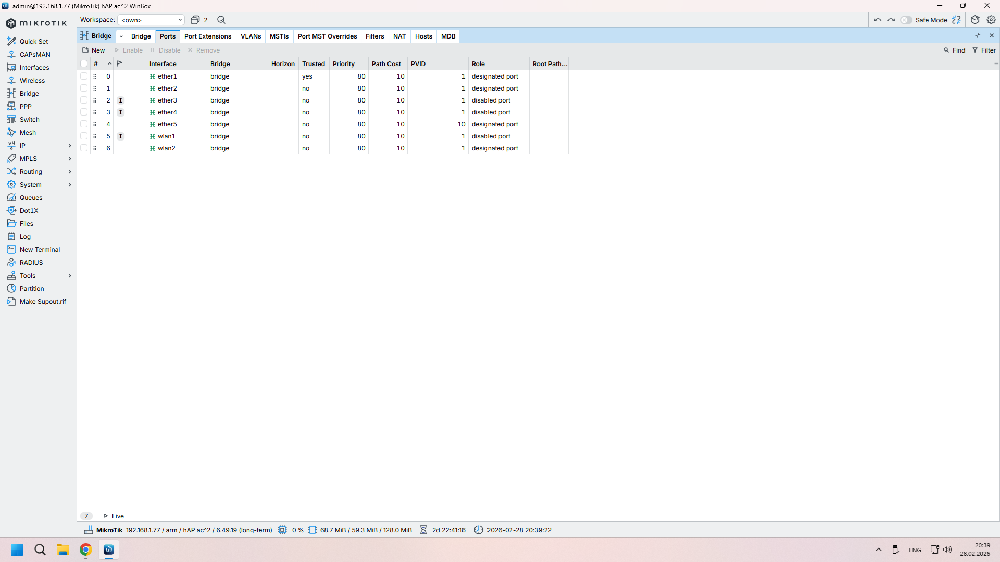

**Настройка DHCP-клиента (чтобы MikroTik получил IP от провайдера)**

- IP → DHCP Client → + New
- Interface: bridge1
- Включить Use Peer DNS и Add Default Route
- OK

Через несколько секунд в списке появится запись со статусом **bound**. В колонке Address будет IP-адрес, полученный от провайдера. Теперь заходить в WinBox можно по этому IP.

**Финальная очистка**

Проверяем, не осталось ли лишнего:

- IP → Addresses — удаляем всё, кроме записи, полученной по DHCP (особенно 192.168.88.1)
- IP → Firewall → NAT — удаляем все правила
- IP → DHCP Server — удаляем все серверы
- IP → Pool — удаляем все пулы

**Обновление прошивки**

После того как роутер получил доступ в интернет, **крайне рекомендуется** обновить прошивку:

- System → Packages → Check For Updates → Download & Upgrade
- После перезагрузки зайти в System → RouterBOARD
- Если версия **firmware** отличается от текущей, нажать **Update** и снова перезагрузить роутер

> [!CAUTION]
> ⚠️ **ВАЖНО!** Ни в коем случае не отключайте питание во время обновления — это может превратить роутер в «кирпич».

#### Настройка Wi-Fi (бесшовный роуминг)

##### Настраиваем Wi-Fi с тем же именем (SSID) и паролем, что у провайдера.

**Интерфейсы Wi-Fi:**

- Wireless → вкладка Wi-Fi Interfaces
- Выбираем wlan1 и wlan2 по очереди:
  - Mode: ap bridge
  - Band: для wlan1 — 2.4 GHz-B/G/N, для wlan2 — 5GHz-N/AC
  - SSID: точно такое же, как у роутера провайдера
  - Country: russia (или russia3, если есть; если не работает, попробуйте no_country_set)

**Безопасность:**

- Wireless → Security Profiles
- Выбираем профиль default:
  - Mode: dynamic keys
  - Authentication Types: WPA2 PSK
  - WPA2 Pre-Shared Key: пароль, как у провайдера

**Включаем Wi-Fi (если выключен):**

- Interfaces → выбираем wlan1, wlan2 → Enable

После этих настроек MikroTik работает в режиме моста. Все устройства получают IP от провайдера, а Wi-Fi динамически переключается между роутерами.

---

### 🔒 Настройка VLAN для сервера (изолированная сеть)
Выделим порт **ether5** в отдельную подсеть **10.10.10.0/24**. Сервер будет изолирован от остальных устройств в квартире, но сможет выходить в интернет. Доступ к нему будет только с основного ПК.
- **Создаём VLAN-интерфейс:**
  	
    - Interfaces → + New → VLAN
    - Name: vlan10 (можно любое имя, например vlan-server)
    - VLAN ID: 10
    - Interface: bridge1
    - OK

- **Назначаем IP-адрес VLAN:**

   - IP → Addresses → + New
   - Address: 10.10.10.1/24
   - Network: 10.10.10.0
   - Interface: vlan10
   - OK

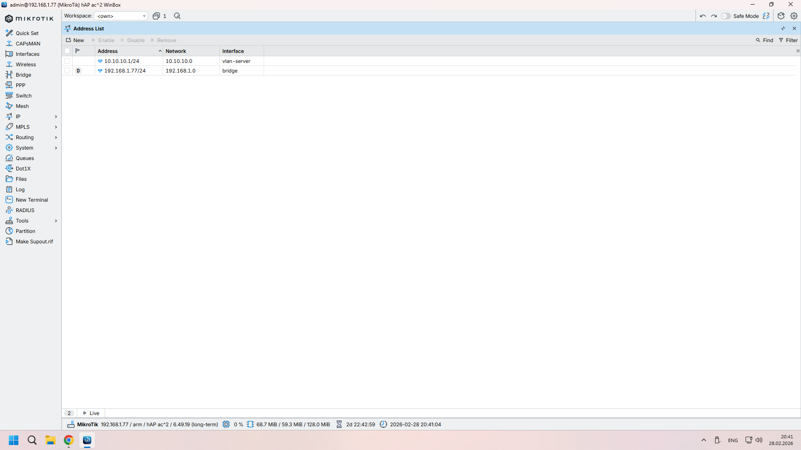

- **Настраиваем DHCP-сервер для VLAN**

  - IP → DHCP Server → DHCP Setup
  - Выбираем интерфейс: vlan10
  - Мастер предложит:
    * Address Space: 10.10.10.0/24 (оставить)
    * Gateway for DHCP Network: 10.10.10.1 (оставить)
    * Addresses to Give Out: 10.10.10.10-10.10.10.254 (можно оставить)
    * DNS Servers: 8.8.8.8, 8.8.4.4
  - Проходим мастер до конца.

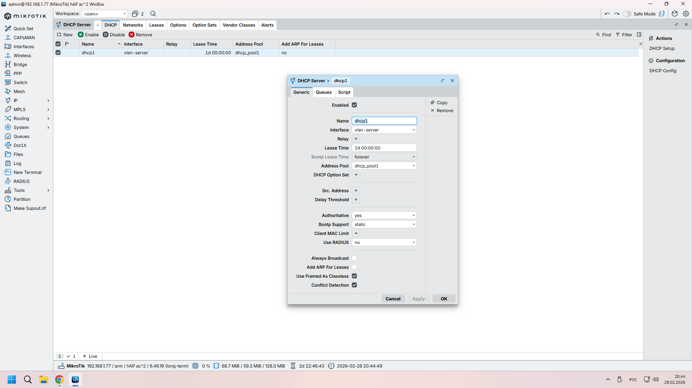

- **Настройка порта для сервера (PVID)**

  - Bridge → Ports
  - Открываем ether5, переходим на вкладку VLAN
  - PVID: 10


*Обратите внимание: PVID для ether5 выставлен в 10*

- **🔑 КЛЮЧЕВОЙ МОМЕНТ — таблица VLAN**

  - Bridge → VLAN → + New
  - VLAN IDs: 10
  - Tagged: bridge1
  - Untagged: ether5
  - OK

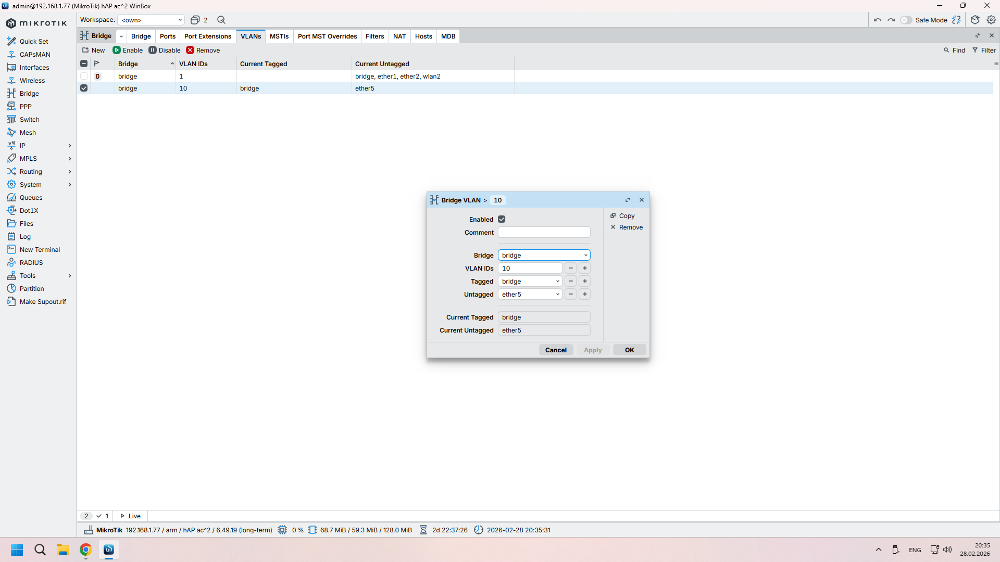

>**Почему это важно:** Добавляя bridge1 в Tagged, мы говорим MikroTik: «Этот VLAN нужно обрабатывать». Без этого сервер получит IP, но не увидит шлюз и интернет.

- **Включаем VLAN Filtering**

  - Bridge → Bridge → открываем интерфейс bridge1 → вкладка VLAN
  - Включаем VLAN Filtering

- **NAT для выхода в интернет**

  - IP → Firewall → NAT → + New
  - Chain: srcnat
  - Src. Address: 10.10.10.0/24
  - Out. Interface: bridge1
  - Action: masquerade
  - OK

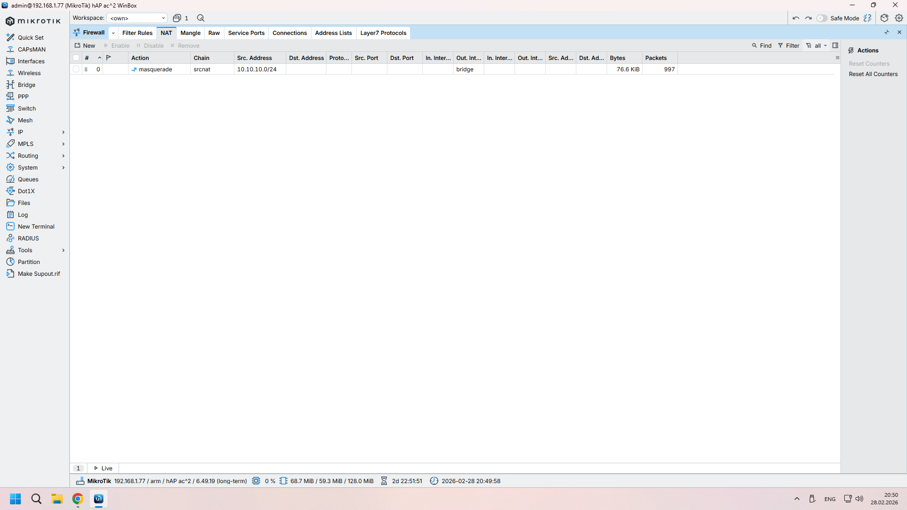

---

#### ✅ Проверка VLAN

1. Подключаем сервер к ether5. Он должен получить IP из диапазона 10.10.10.x (например, 10.10.10.254). Можно проверить командой ip a на самом сервере.

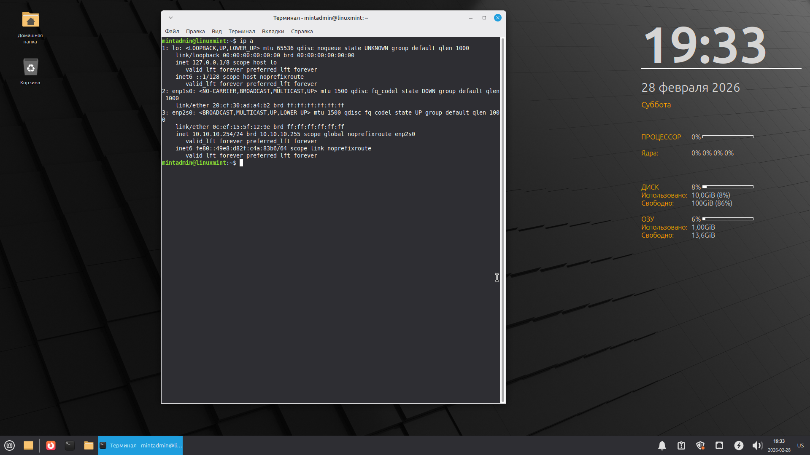

2.	С основного ПК пробуем подключиться по SSH:
```powershell
ssh mintadmin@10.10.10.254
```
Если подключение успешно — VLAN работает, сервер доступен.
3.	(Опционально) Если нужно проверить пинг — добавьте правило на MikroTik:
```
/ip firewall filter add chain=forward action=accept protocol=icmp src-address=IP_адрес_ПК
dst-address=10.10.10.254 comment="allow ping from PC"
```

---

#### 🧩 Возникшая проблема
На этом этапе у меня возникла неожиданная сложность. Несмотря на то, что:
- ✅ MikroTik прекрасно пинговал сервер (10.10.10.254)
- ✅ Сервер так же успешно пинговал MikroTik (10.10.10.1)
- ✅ Все настройки VLAN были выполнены верно

...с моего основного ПК (192.168.1.69) сервер был недоступен. Пинг не проходил, SSH не подключался.
#### 🔍 В чём была причина
Основной роутер провайдера (**GPON**, 192.168.1.254) ничего не знал о существовании изолированной подсети **10.10.10.0/24**. Когда пакет с моего ПК уходил на адрес **10.10.10.254**, он отправлялся на шлюз по умолчанию — роутер провайдера. А тот, не имея понятия о **VLAN 10**, терял пакеты (пытался отправить их в интернет).
При этом **MikroTik** — «ворота» в эту подсеть — оставался в стороне: пакеты до него просто не доходили.
#### ✅ Решение — статический маршрут на ПК
Чтобы объяснить моему ПК, что за сетью **10.10.10.0/24** нужно ходить не к провайдеру, а к **MikroTik** (192.168.1.77), я добавил статический маршрут в **Windows**.
Команда (запускать PowerShell от имени администратора):
```powershell
route add -p 10.10.10.0 mask 255.255.255.0 192.168.1.77 metric 100
```
##### Что означает эта команда:
- **-p** (persistent) — маршрут сохраняется после перезагрузки
- **10.10.10.0** — сеть назначения
- **mask 255.255.255.0** — маска подсети (/24)
- **192.168.1.77** — IP-адрес **MikroTik** (шлюз для этой сети)
- **metric 100** — приоритет маршрута

После этого подключение по SSH заработало. Пакеты с ПК начали уходить на MikroTik, а тот уже правильно направлял их в VLAN 10.

> [!TIP]
> **📌 Важное замечание**: если у вас несколько устройств, которым нужен доступ в VLAN, для каждого из них придётся либо прописывать такой маршрут вручную, либо настроить DHCP-сервер на MikroTik для раздачи клиентам информации об этом маршруте (через DHCP-опцию 121). В моём случае доступ был нужен только с основного ПК, поэтому ручной маршрут — самое простое и надёжное решение.

---

### 🛡️ Правила безопасности
Чтобы в VLAN мог заходить только основной ПК, добавим правила файрвола. **Порядок важен!**
Заходим в **IP → Firewall → вкладка Filter Rules**:
1.	**Разрешить уже установленные соединения:**
    - Chain: forward
    - Connection State: established, related
    - Action: accept
2.	**Разрешить SSH с основного ПК на сервер:**
    - Chain: forward
    - Protocol: tcp
    - Dst. Port: 22
    - Src. Address: 192.168.1.69
    - Dst. Address: 10.10.10.254
    - Action: accept
3.	**Разрешить MPD с основного ПК:**
    - То же, но Dst. Port: 6600
4.	**Запретить всё остальное:**
    - Chain: forward
    - Src. Address: 192.168.1.0/24
    - Dst. Address: 10.10.10.0/24
    - Action: drop

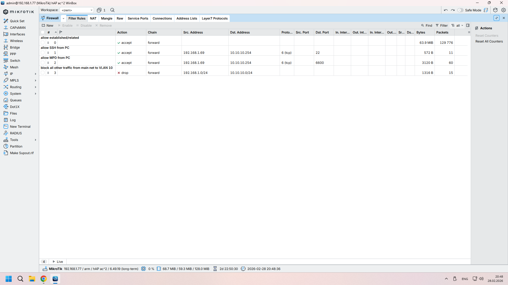

---

## 🎵 MPD (Music Player Daemon)
Все команды выполняются на **сервере** в установленной **Linux Mint**.

##### Установка MPD и клиентов
```bash
sudo apt update
sudo apt install mpd mpc -y
```
Останавливаем MPD перед настройкой:
```bash
sudo systemctl stop mpd
```
##### Настройка MPD

Редактируем конфиг:
```bash
sudo nano /etc/mpd.conf
```
Проще удалить дефолтный конфиг и вставить новый:
```conf
# ---------- ОСНОВНЫЕ НАСТРОЙКИ ----------
music_directory    "/home/твой_пользователь/Music"
playlist_directory "/var/lib/mpd/playlists"
db_file            "/var/lib/mpd/tag_cache"
log_file           "/var/log/mpd/mpd.log"
pid_file           "/run/mpd/pid"
state_file         "/var/lib/mpd/state"

# ---------- СЕТЕВЫЕ НАСТРОЙКИ ----------
bind_to_address    "0.0.0.0"
port               "6600"

# ---------- НАСТРОЙКА ЗВУКА (ALSA) ----------
audio_output {
    type            "alsa"
    name            "My ALSA Device"
    device          "hw:0,0"
    mixer_type      "software"
}

# ---------- HTTP-СТРИМ (опционально) ----------
audio_output {
    type            "httpd"
    name            "My HTTP Stream"
    encoder         "vorbis"
    port            "8000"
    bitrate         "128"
    format          "44100:16:2"
    max_clients     "5"
}

# ---------- ПРАВА ДОСТУПА ----------
user               "твой_пользователь"
```
> [!TIP]
> **Важно:** замените твой_пользователь на реальное имя пользователя (узнать можно командой **whoami**).

Параметр device для звука можно уточнить с помощью **aplay -l**. Формат: **hw:X,Y**, где X — номер карты, Y — номер устройства.
**Сохраняем файл (Ctrl+X, Y, Enter).**

Создаём папку для музыки (если её нет):
```bash
mkdir -p /home/твой_пользователь/Music
```
##### Запуск MPD
```bash
sudo systemctl start mpd
sudo systemctl enable mpd   # автозапуск при старте системы
```
##### Проверяем статус:
```bash
sudo systemctl status mpd
```
##### Проверка локально
Добавим тестовый файл:
```bash
wget -O /home/твой_пользователь/Music/test.mp3 https://download.samplelib.com/mp3/sample-15s.mp3
```
Обновляем базу:
```bash
mpc update
```
Смотрим, что в базе:
```bash
mpc listall
```
Добавляем и играем:
```bash
mpc add test.mp3
mpc play
```
Если музыка играет — всё работает!

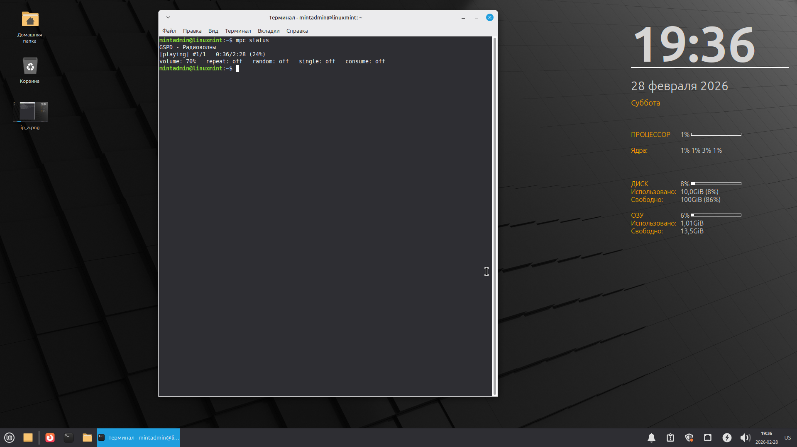

---

### 🎮 Настройка клиентов
Я остановил свой выбор на клиенте **Cantata**.
Для **Windows**:
Скачать с [GitHub releases](https://github.com/nullobsi/cantata/releases) (я использовал Windows Standalone).
При первом открытии задаём настройки:
- **Хост:** IP адрес сервера (10.10.10.254)
- **Порт:** 6600
- **Папка с музыкой:** путь к папке на сервере (например, /mnt/hdd_1tb/Music)

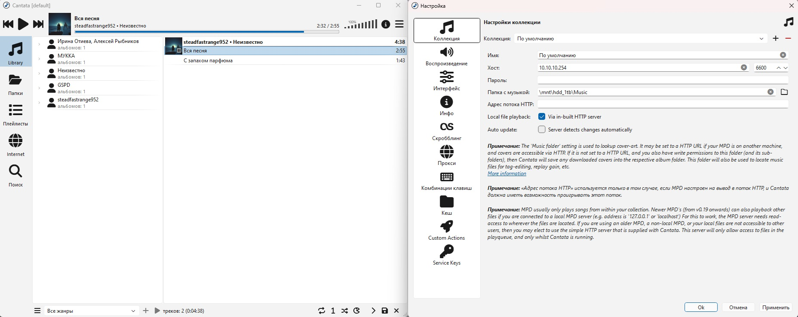

---

### 📤 Как заливать музыку на сервер
**Способ 1:** WinSCP (мой выбор, только Windows)
1.	Скачать WinSCP
2.	Настройки подключения:
    - Протокол: SFTP
    - Хост: 10.10.10.254
    - Порт: 22
    - Имя пользователя: mintadmin
    - Пароль: (пароль пользователя)
3.	Login (при первом подключении подтвердить доверие серверу)

**Способ 2:** SCP (из командной строки)

На основном ПК (PowerShell):
```powershell
scp D:\Music\*.mp3 mintadmin@10.10.10.254:/home/mintadmin/Music/
```
**Способ 3:** Samba (сетевая папка)

На сервере:
```bash
sudo apt install samba
sudo smbpasswd -a mintadmin
sudo nano /etc/samba/smb.conf
```
В конец файла добавить:
```ini
[Music]
   path = /home/mintadmin/Music
   browseable = yes
   read only = no
   guest ok = no
   valid users = mintadmin
```
Перезапустить Samba:
```bash
sudo systemctl restart smbd
```
Теперь на Windows можно открыть **\\10.10.10.254\Music** и просто копировать файлы.

---

### 🔄 Обновление базы после добавления музыки
1. Вручную (на сервере или через SSH):
```bash
mpc update
```
2. В Cantata: кнопка **«Обновить базу данных»** в меню (три полоски справа). Подтвердить.

3. **Автоматическое** обновление (добавить в mpd.conf):
```text
auto_update    "yes"
```

---

### 🔧 Команды и конфиги
##### 📁 Файлы конфигурации
- [Mikrotik](configs/mikrotik-backup.rsc) — полный экспорт конфигурации MikroTik (для Wi-Fi укажите свой пароль)
- [MPD](configs/mpd.conf) — конфигурационный файл MPD
- [fstab](configs/fstab) — таблица монтирования дисков на сервере

---

### 📝 Полезные команды (шпаргалка)
#### MikroTik (RouterOS)
Просмотр текущей конфигурации:
```bash
/export hide-sensitive
```
Сохранение конфигурации в файл:
```bash
/export file=mikrotik-backup
```
**Файл появится в разделе Files и его можно скачать через WinBox (Files).**

Восстановление из файла:
```bash
/import file-name=mikrotik-backup.rsc
```
Полезные просмотры:
```bash
/interface bridge print                         # информация о мосте
/interface bridge port print                    # порты в мосте и их PVID
/interface bridge vlan print                    # таблица VLAN
/ip address print                               # IP-адреса
/ip route print                                 # таблица маршрутизации
/ip firewall filter print where chain=forward   # правила фильтрации
/ip firewall nat print                          # правила NAT
/ip dhcp-server lease print                     # кто получил IP (если DHCP на MikroTik)
```
Диагностика:
```bash
/ping 10.10.10.254                       # проверить доступность сервера
/tool traceroute 8.8.8.8                 # проверить маршрут до интернета
/log print                               # посмотреть логи
```
### 🐧 Linux (сервер)
#### Управление MPD:
```bash
mpc status                                 # текущее состояние
mpc play                                   # играть
mpc pause                                  # пауза
mpc stop                                   # стоп
mpc next                                   # следующий трек
mpc prev                                   # предыдущий
mpc volume +5                              # громкость +5
mpc volume -5                              # громкость -5
mpc update                                 # обновить базу музыки
mpc listall                                # показать всю музыку
mpc add "путь/к/треку"                     # добавить трек в очередь
mpc clear                                  # очистить очередь
mpc current                                # что играет сейчас
```
#### Системные:
```bash
sudo systemctl status mpd                   # статус MPD
sudo systemctl restart mpd                  # перезапуск MPD
sudo systemctl enable mpd                   # автозапуск MPD
sudo journalctl -u mpd -f                   # логи MPD в реальном времени
```
#### Диски:
```bash
lsblk -f                                    # показать все диски и точки монтирования
df -h                                       # свободное место
sudo blkid                                  # UUID дисков
sudo nano /etc/fstab                        # редактировать автомонтирование
```
#### Сеть:
```bash
ip a                                        # показать IP-адреса
ping 10.10.10.1                             # проверить шлюз (MikroTik)
ping 8.8.8.8                                # проверить интернет
ss -tlnp | grep 6600                        # проверить, слушается ли порт MPD
sudo tcpdump -i any port 6600               # слушать трафик MPD
```
### Windows (основной ПК)
#### Статический маршрут:
Просмотр маршрутов:
```powershell
route print -4
```
#### Добавление маршрута (от имени администратора)
```powershell
route add -p 10.10.10.0 mask 255.255.255.0 192.168.1.77 metric 100
```
#### Удаление маршрута
```powershell
route delete 10.10.10.0
```
#### SSH:
```powershell
ssh mintadmin@10.10.10.254                  # подключение к серверу
scp файл mintadmin@10.10.10.254:/путь/      # копирование файла на сервер
```
